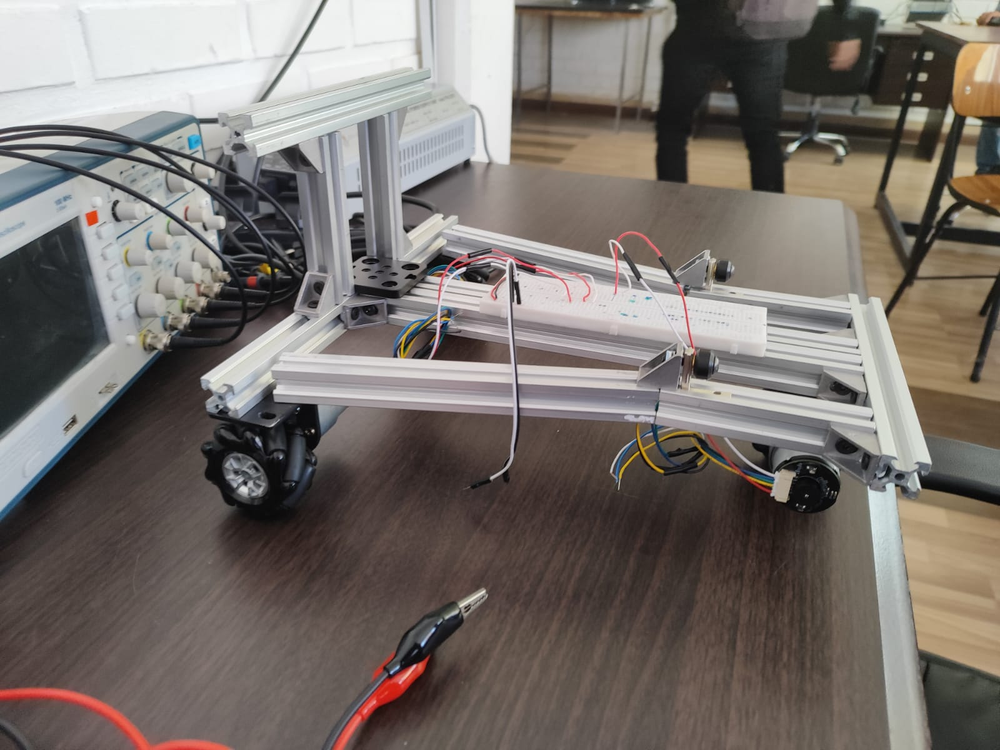
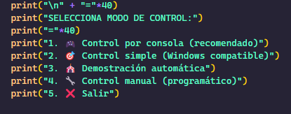

<a name="readme-top"></a>
![Maintained][Maintained-shield]
![Forks][Forks-shield]
![Pull Request][PullRequest-shield]
![Pull Request Closed][PullRequestclosed-shield]

<!-- PROJECT LOGO -->
<br />
<div align="center">
  <a href="https://github.com/NicoZela23/CV-Robotic-Claw">
    
  </a>

<h3 align="center">Omni Robot</h3>

  <p align="center">
    Motoron powered Robotic
    <br />
    <a href="https://github.com/NicoZela23/Omni-Motoron-Robot/blob/main/README.md"><strong>Explora la documentacion »</strong></a>
    <br />
    <br />
    ·
    <a href="https://github.com/NicoZela23/Omni-Motoron-Robot/issues">Reportar Bug</a>
    ·
    <a href="https://github.com/NicoZela23/Omni-Motoron-Robot/issues">Solicitar Feature</a>
  </p>
</div>

<!-- TABLE OF CONTENTS -->
<details>
  <summary>Tabla de contenido</summary>
  <ol>
    <li>
      <a href="#acerca-del-proyeto">Acerca Del Proyeto</a>
    </li>
    <li><a href="#hardware-necesario">Hardware Necesario</a></li>
    <li><a href="#configuracion-de-entorno">Configuracion de entorno</a></li>
    <li>
      <a href="#descarga">Descarga</a>
    </li>
    <li><a href="#instalacion">Instalacion</a></li>
    <li><a href="#configuracion-del-robot">Configuracion del robot</li>
    <li><a href="#tech-stack">Tech Stack</a></li>
    <li><a href="#descripcion-tecnica">Descripcion tecnica</a></li>
  </ol>
</details>

## Acerca Del Proyeto

`Omni Robot` es un proyecto Open Source hecho para probar los conceptos de robotica especializada relacionado con controladores avanzados, motores driver, encoder y control asincrono basado en `SSH`

- El raspberry pi 4 se encarga del control y orquestracion de movimientos del robot a travez de un script de Python
- Se ejecuta la secuancia de configuracion de los motores los cuales podran acceder a las difentes acciones de movimiento (1-5)

## Hardware Necesario

> [!IMPORTANT]
> Este proyecto requiere de `Hardware` especifico tanto para ser construido como para ser usado, ademas de una estructura para sostener los motores.

- Raspberry Pi 4 Model B
- Pololu M3H550 Triple Motor Driver
- 3 x JGB37-520 motor dc
- 3 x JGB37-520
- Fuente de alimentación
- Protoboard
- Cables jumper y terminales

Considerando la correcta implementacion, se debe consultar al manual y descripcion en [Omni Robot Docs](https://drive.google.com/file/d/1BgFtPWnTz3hPScd1Ap16ELC2zDu8Rw9G/view?usp=sharing)

**Siendo este una construccion especifica esperando un resultado final como este:**



## Configuracion de entorno

Considerando que el proyecto hace uso de la libreria `motoron` es importante instalar la misma, considerando que no esta disponible directamente desde `pip` esta debe ser integrada de la siguiente manera desde el raspberry pi

```
$ mkdir project_library
$ cd project_library
$ git pull https://github.com/pololu/motoron-python.git
```

Con esto tendremos disponible toda la libreria junto con ejemplos de uso para los casos de us `motoron`

## Descarga

> [!IMPORTANT]
> Ya que esta libreria es especifica del fabricante `Pololu` para poder hacer uso de la libreria `motoron` debemos clonar este proyecto y extraer el script `robot.py` dentro de los archivos de la carpeta `motoron-python` donde se encuentran disponibles los archivos core

```
$ cd project_library
$ cd motoron-python
$ git clone https://github.com/NicoZela23/Omni-Motoron-Robot.git
$ mv Omni-Motoron-Robot/* .
```

## Instalacion

El proyecto no requiere de una instalacion mas alla de la ejecucion del script de Python `robot.py`

```
$ sudo python robot.py
```

## Configuracion del robot

La configuracion mas crucial del proyecto recaera en el uso del mismo siendo las opciones base del menu, todo ejecutado desde la shell con comandos simples ingresados por consola



## Tech Stack

[]()
[]()
[](https://www.python.org/)
[]()

## Descripcion tecnica

El script `robot.py` permite:

- Inicializar y configurar la placa Motoron vía I2C.
- Leer los encoders conectados a los motores para obtener posición y velocidad.
- Controlar el movimiento del robot mediante comandos de teclado.
- Mostrar información en tiempo real sobre el estado de los motores.

### Estructura del Script `robot.py`

El script está organizado en las siguientes secciones:

- **Importación de librerías**
- **Configuración de Motoron**
- **Configuración de encoders y GPIO**
- **Funciones auxiliares** (cálculo de velocidades, impresión de estado, lectura de teclado, etc.)
- **Lógica principal de control**

### Configuración de Hardware

#### Motoron

- **Placa utilizada:** Motoron (controlador de motores DC vía I2C)
- **Dirección I2C:** 16 (puede variar según configuración física)
- **Motores soportados:** 3

#### Encoders

- **Cantidad:** 3 (uno por motor)
- **CPR (Counts Per Revolution):** 1000
- **Pines asignados:**

| Motor | pin_a | pin_b |
| ----- | ----- | ----- |
| 1     | 22    | 27    |
| 2     | 18    | 15    |
| 3     | 17    | 14    |

#### GPIO y Pines

- **Modo:** BCM (Broadcom SOC channel)
- **Pull-up:** Activado para evitar estados flotantes

### Lógica de Control de Motores

- **Aceleración máxima:** 80
- **Desaceleración máxima:** 300
- **Velocidad base:** 750 (ajustable)
- **Control individual de cada motor** mediante la función `set_motors(speed1, speed2, speed3)`

### Lectura y Cálculo de Encoders

- **Lectura por interrupciones:** Se utiliza `GPIO.add_event_detect` para detectar cambios en los pines de los encoders.
- **Cálculo de velocidad:**
  - Se calcula la diferencia de cuentas en un intervalo de tiempo (`delta_counts / dt`).
  - Conversión a RPM: `(velocidad_encoder * 60) / CPR`.
- **Almacenamiento de cuentas y velocidades** en diccionarios por motor.

### Control Manual por Teclado

- **Lectura no bloqueante:** Permite detectar teclas sin detener el programa.
- **Teclas asignadas:**

| Tecla | Acción             | Motores afectados |
| ----- | ------------------ | ----------------- |
| W     | Adelante           | 1, 2, 3           |
| S     | Atrás              | 1, 2, 3           |
| A     | Izquierda (giro)   | 2                 |
| D     | Derecha (giro)     | 1                 |
| Q     | Diagonal izquierda | 2, 3              |
| E     | Diagonal derecha   | 1, 3              |
| P     | Salir              | -                 |

- **Detección de pulsación:** Si no se detecta una tecla durante 0.5 segundos, los motores se detienen automáticamente.

### Funciones Clave

- `setup_motoron(mc, address)`: Inicializa y configura la placa Motoron.
- `setup_gpio_encoders()`: Configura los pines GPIO para los encoders y asocia callbacks.
- `encoder_callback(channel)`: Actualiza el conteo de encoders según el cambio detectado.
- `calculate_velocities()`: Calcula la velocidad de cada motor en cuentas por segundo.
- `calculate_rpm(encoder_velocity, counts_per_revolution)`: Convierte la velocidad a RPM.
- `print_status()`: Muestra el estado actual de los motores.
- `get_key_nonblocking(timeout)`: Lee teclas del teclado sin bloquear la ejecución.
- `set_motors(speed1, speed2, speed3)`: Asigna velocidades a los motores.
- `stop_motors()`: Detiene todos los motores.

### Manejo de Errores y Seguridad

- **Inicialización protegida:** Si falla la inicialización de Motoron, el programa muestra un error y termina.
- **Manejo de interrupciones:** Captura `KeyboardInterrupt` para detener los motores y limpiar los GPIO.
- **Limpieza de recursos:** Siempre se ejecuta `GPIO.cleanup()` al finalizar.

### Flujo Principal del Programa

1. Inicializa Motoron y los encoders.
2. Configura aceleración y desaceleración de los motores.
3. Espera a que el usuario presione ENTER para comenzar.
4. Entra en un bucle donde:
   - Lee teclas del usuario.
   - Controla los motores según la tecla presionada.
   - Calcula y muestra el estado de los motores periódicamente.
   - Detiene los motores si no hay pulsación reciente.
5. Al salir, detiene los motores y limpia los GPIO.

### Tablas de Referencia

#### Asignación de Pines de Encoders

| Motor | pin_a | pin_b |
| ----- | ----- | ----- |
| 1     | 22    | 27    |
| 2     | 18    | 15    |
| 3     | 17    | 14    |

#### Comandos de Teclado

| Tecla | Acción             |
| ----- | ------------------ |
| W     | Adelante           |
| S     | Atrás              |
| A     | Izquierda (giro)   |
| D     | Derecha (giro)     |
| Q     | Diagonal izquierda |
| E     | Diagonal derecha   |
| P     | Salir              |

### Recomendaciones y Buenas Prácticas

- **Verificar conexiones físicas** antes de ejecutar el script.
- **No modificar la dirección I2C** sin ajustar el hardware.
- **Ajustar los parámetros de aceleración y velocidad** según el peso y características del robot.
- **Utilizar fuentes de alimentación adecuadas** para evitar caídas de voltaje.
- **Probar individualmente cada motor y encoder** antes de pruebas completas.

[Maintained-shield]: https://img.shields.io/badge/Maintained%3F-yes-green.svg
[Forks-shield]: https://img.shields.io/github/forks/NicoZela23/Omni-Motoron-Robot.svg
[PullRequest-shield]: https://img.shields.io/github/issues-pr/NicoZela23/Omni-Motoron-Robot.svg
[PullRequestclosed-shield]: https://img.shields.io/github/issues-pr-closed/NicoZela23/Omni-Motoron-Robot.svg
