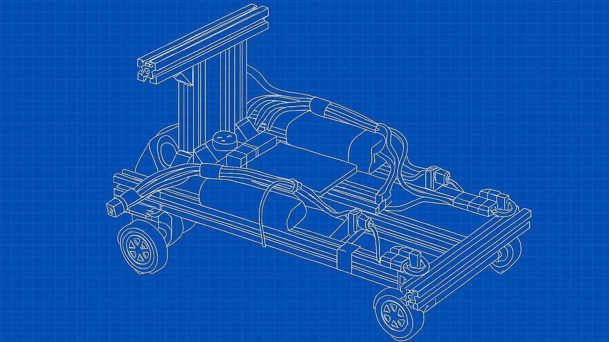
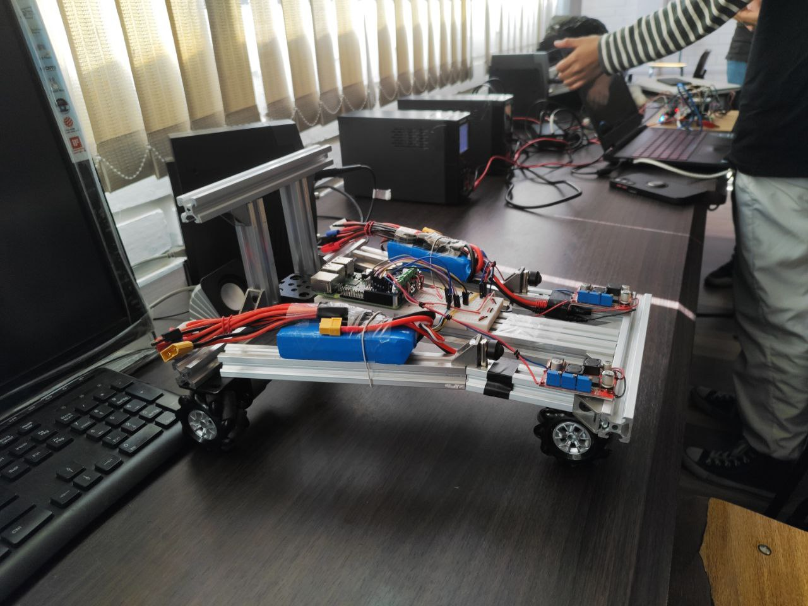

<a name="readme-top"></a>
![Maintained][Maintained-shield]
![Forks][Forks-shield]
![Pull Request][PullRequest-shield]
![Pull Request Closed][PullRequestclosed-shield]

<!-- PROJECT LOGO -->
<br />
<div align="center">
  <a href="https://github.com/NicoZela23/CV-Robotic-Claw">
    
  </a>

<h3 align="center">Omni Robot</h3>

  <p align="center">
    Motoron powered Robotic Car
    <br />
    <a href="https://github.com/NicoZela23/Omni-Motoron-Robot/blob/main/README.md"><strong>Explora la documentacion »</strong></a>
    <br />
    <br />
    ·
    <a href="https://github.com/NicoZela23/Omni-Motoron-Robot/issues">Reportar Bug</a>
    ·
    <a href="https://github.com/NicoZela23/Omni-Motoron-Robot/issues">Solicitar Feature</a>
  </p>
</div>

<!-- TABLE OF CONTENTS -->
<details>
  <summary>Tabla de contenido</summary>
  <ol>
    <li>
      <a href="#acerca-del-proyeto">Acerca Del Proyeto</a>
    </li>
    <li><a href="#hardware-necesario">Hardware Necesario</a></li>
    <li><a href="#configuracion-de-entorno">Configuracion de entorno</a></li>
    <li><a href="#instalacion-y-ejecucion">Instalacion y Ejecucion</a></li>
    <li><a href="#descripcion-tecnica">Descripcion tecnica</a></li>
    <li><a href="#tech-stack">Tech Stack</a></li>
    <li><a href="#video-funcionamiento">Video funcionamiento</a></li>
  </ol>
</details>

## Acerca Del Proyeto

`OmniRobot` es un proyecto de robótica de código abierto diseñado para construir y programar un robot móvil omnidireccional desde cero. Este repositorio no solo contiene el código de control, sino que también se basa en una guía de hardware detallada , pensada para guiar a usuarios sin experiencia previa en robótica o electrónica.

El robot utiliza un chasis triangular con tres ruedas omnidireccionales dispuestas a 120° , lo que le permite una movilidad completa en cualquier dirección: adelante, atrás, desplazamientos laterales, diagonales y rotación sobre su propio eje.

El cerebro de la operación es una **_Raspberry Pi_** 4, que ejecuta un script en Python para orquestar todos los movimientos. El control preciso de los motores y la lectura de su velocidad se logran mediante componentes especializados, lo que convierte a este proyecto en una excelente plataforma de aprendizaje.

---

### Características Principales

- **Control Centralizado**: Una **_Raspberry Pi 4 Model B_** (4GB RAM) se encarga de toda la lógica de alto nivel.

- **Movimiento Omnidireccional**: Impulsado por tres motores DC JGB37-520 con encoders de efecto Hall integrados.

- **Control de Potencia Avanzado**: Utiliza un driver Pololu M3H550 Triple Motor Driver, que se comunica con la **_Raspberry Pi_** a través del protocolo I2C para gestionar la velocidad y dirección de cada motor de forma independiente.

- **Alimentación Autónoma**: El sistema es totalmente portátil, alimentado por dos baterías LiPo de 11.1V y reguladores de voltaje DC-DC para suministrar la energía necesaria tanto a la **_Raspberry Pi_** (5V) como a los motores (10.5V).

- **Control Remoto**: El robot se opera de forma inalámbrica a través de una conexión SSH, permitiendo el control manual mediante el teclado de una laptop o PC.

- **Software**: El control se implementa en un único script de Python, utilizando las librerías motoron para la comunicación con el driver y RPi.GPIO para la lectura de los encoders.

---

### ¿Qué aprenderás con este proyecto?

- Ensamblar una estructura robótica mecánica a partir de perfiles de aluminio.

- Conectar y controlar motores de corriente continua (DC) y leer su velocidad en tiempo real utilizando encoders.

- Implementar un sistema de alimentación autónomo y seguro utilizando baterías LiPo y reguladores de voltaje.

- Controlar hardware externo (un driver de motores) desde la Raspberry Pi utilizando el bus de comunicación I2C.

- Desarrollar un script de control en Python que gestione entradas de usuario (teclado), procese datos de sensores (encoders) y actúe sobre los motores de forma concurrente.

## Hardware Necesario

> [!IMPORTANT]
> Este proyecto requiere de Hardware específico tanto para su construcción como para su operación.  
> La estructura principal se ensambla con perfiles de aluminio y soportes metálicos que sostienen los componentes.

A continuación se detalla la lista completa de componentes electrónicos y estructurales utilizados:

| **Componente**         | **Cantidad** | **Modelo / Especificaciones**                                       |
| ---------------------- | ------------ | ------------------------------------------------------------------- |
| Microcontrolador       | 1            | Raspberry Pi 4 Model B (4GB RAM)                                    |
| Controlador de Motor   | 1            | Pololu M3H550 Triple Motor Driver                                   |
| Motores DC             | 3            | JGB37-520 con encoder de efecto Hall integrado (12V, 330 RPM)       |
| Ruedas                 | 3            | Ruedas omnidireccionales de 60 mm con rodillos laterales            |
| Baterías               | 2            | LiPo 3S (3 celdas) de 11.1V, 2200mAh (Marca Turnigy)                |
| Reguladores de Voltaje | 2            | Regulador descendente (step-down) LM2596 DC-DC                      |
| Chasis                 | 1            | Perfil de aluminio tipo ranurado (modelo 2020)                      |
| Soportes de Motor      | 3            | Soporte metálico personalizado para fijación al chasis              |
| Prototipado y Conexión | Varios       | Protoboard, cables jumper (macho-macho, hembra-hembra) y terminales |
| Elementos de Fijación  | Varios       | Tornillos tipo Allen, tuercas en T, escuadras y arandelas           |

---

> [!NOTE]
> Para obtener los detalles completos sobre el ensamblaje, las conexiones eléctricas y los diagramas,  
> es fundamental consultar la guía de construcción y el manual de hardware en [Omni Robot Docs](https://drive.google.com/file/d/1BgFtPWnTz3hPScd1Ap16ELC2zDu8Rw9G/view?usp=sharing).

---

### Resultado final de la construcción:



## Configuracion de entorno

Para replicar este proyecto, es necesario configurar una **Raspberry Pi 4** desde cero.  
Los siguientes pasos te guiarán a través del proceso para dejar el equipo listo para clonar este repositorio y ejecutar el código.

---

### Paso 1: Instalar Raspberry Pi OS en la tarjeta SD

La forma más sencilla de preparar el sistema operativo es usando la herramienta oficial **Raspberry Pi Imager**:

1. Descarga e instala **Raspberry Pi Imager** en tu computadora desde la [web oficial de Raspberry Pi](https://www.raspberrypi.com/software/).
2. Inserta una tarjeta **microSD** en tu computadora.
3. Abre Raspberry Pi Imager y selecciona:

   - **Raspberry Pi Device**: `Raspberry Pi 4`
   - **Operating System**:  
     `Raspberry Pi OS (other)` → `Raspberry Pi OS Lite (64-bit)`

     > Se recomienda la versión _Lite_ (sin escritorio) para un mejor rendimiento en proyectos _headless_ (sin monitor).

   - **Storage**: Selecciona tu tarjeta microSD.

---

### Paso 2: Pre-configuración del Sistema (_Headless Setup_)

Antes de escribir la imagen en la SD, puedes **pre-configurar** los ajustes más importantes para un acceso remoto inmediato:

1. En Raspberry Pi Imager, haz clic en el icono del engranaje ⚙️ para abrir el **menú de configuración avanzada**.
2. Configura lo siguiente:

   - `Set hostname`: Elige un nombre para tu robot, por ejemplo: `omnirobot.local`.
   - `Enable SSH`: Marca esta opción y selecciona _Use password authentication_.
   - `Set username and password`: Crea un usuario y contraseña para acceder a tu Raspberry Pi.
   - `Configure wireless LAN`: Ingresa el **SSID** y contraseña de tu red Wi-Fi.
   - `Set locale settings`: Configura tu zona horaria y la distribución del teclado.

3. Guarda los cambios y haz clic en **WRITE** para flashear la tarjeta SD.

---

### Paso 3: Primer Arranque y Conexión SSH

1. Expulsa la tarjeta **microSD** de tu computadora e insértala en la **Raspberry Pi**.
2. Conecta la alimentación **USB-C** (se recomienda un cargador de **5V/3A**) para encenderla.
3. Espera uno o dos minutos para que arranque y se conecte a tu red Wi-Fi.
4. Desde otra computadora en la misma red, abre una terminal y conéctate usando **SSH**:

```bash
ssh tu_usuario@omnirobot.local
```

---

### Paso 4: Actualizar Sistema y Habilitar Interfaces

Una vez conectado por SSH, actualiza los paquetes del sistema y habilita la interfaz I2C:

**Actualiza el sistema:**

```bash
sudo apt update
sudo apt upgrade -y
```

**Abre la herramienta de configuracion**

```bash
sudo raspi-config
```

**Navega a:**

```bash
3 Interface Options → I5 I2C → <Yes>
```

**Esto habilitará el bus I2C.
Luego, reinicia si es necesario:**

```bash
sudo reboot
```

---

### Paso 5: Instalar Dependencias de Software

El script en Python requiere git para clonar repositorios y la librería RPi.GPIO para controlar los pines.

1. Conéctate nuevamente por SSH después del reinicio.
2. Instala Git y pip:

```bash
sudo apt install git python3-pip -y
```

3. Instala la librería GPIO para Python:

```bash
pip install RPi.GPIO
```

---

### Paso 6: Clonar la Librería `motoron`

La librería motoron de Pololu no está disponible en pip, por lo que debe clonarse directamente desde GitHub.

**Crea un directorio para el proyecto y entra en él:**

```bash
mkdir ~/omni_robot_project
cd ~/omni_robot_project
```

**Clona la librería motoron dentro de este directorio:**

```bash
git clone https://github.com/pololu/motoron-python.git
```

Al tener la librería en la misma carpeta que tu script robot.py, Python podrá importarla directamente sin necesidad de una instalación global.

## Instalacion y Ejecucion

Esta sección asume que has completado todos los pasos de la sección **"Configuración de Entorno"**.  
Ya deberías tener una Raspberry Pi configurada con las dependencias necesarias y la librería `motoron-python` clonada.

El siguiente paso es descargar el código de control de este repositorio (**Omni-Motoron-Robot**) y ejecutarlo.

---

### Paso 1: Navegar al Directorio del Proyecto

Asegúrate de estar en el directorio de trabajo creado en los pasos anteriores, donde ya se encuentra la librería de Pololu:

```bash
cd ~/omni_robot_project
```

### Paso 2: Clonar el Código del Proyecto

Ahora, clonaremos el repositorio Omni-Motoron-Robot. Usaremos un comando para que los archivos (robot.py, README.md, etc.) se descarguen directamente en la carpeta actual, junto a la librería motoron-python.

```bash
git clone https://github.com/NicoZela23/Omni-Motoron-Robot.git .
```

[!NOTE]
El . al final del comando git clone es importante, ya que evita la creación de una subcarpeta adicional y mantiene nuestra estructura de proyecto ordenada.

### Paso 3: Verificar la Estructura de Archivos

Después de clonar, la estructura de tu directorio omni_robot_project debería verse así:

```
~/omni_robot_project/
|
|-- motoron-python/      <-- La librería de Pololu que ya estaba aquí.
|   |-- motoron.py
|   |-- examples/
|   |-- ... (otros archivos de la librería)
|
|-- robot.py             <-- El script principal de control del robot.
|
|-- README.md            <-- El archivo README del proyecto.
|
|-- ... (otros archivos de tu repositorio)
```

Esta estructura permite que el script `robot.py` importe la librería `motoron` de forma natural, ya que se encuentran en el mismo directorio raíz del proyecto.

### Paso 4: Ejecutar el Script de Control

Finalmente, para poner el robot en marcha, ejecuta el script principal.

[!IMPORTANT]
Dado que el script necesita acceder directamente a los pines GPIO de la Raspberry Pi para leer los encoders, es probable que necesites ejecutarlo con privilegios de administrador usando sudo.

```bash
sudo python3 robot.py
```

Al ejecutar el comando, verás el menú de control en la terminal. ¡Ya puedes empezar a mover tu robot usando las teclas `W, S, A, D, Q, E`

## Descripcion tecnica

El script `robot.py` permite:

- Inicializar y configurar la placa Motoron vía I2C.
- Leer los encoders conectados a los motores para obtener posición y velocidad.
- Controlar el movimiento del robot mediante comandos de teclado.
- Mostrar información en tiempo real sobre el estado de los motores.

### Estructura del Script `robot.py`

El script está organizado en las siguientes secciones:

- **Importación de librerías**
- **Configuración de Motoron**
- **Configuración de encoders y GPIO**
- **Funciones auxiliares** (cálculo de velocidades, impresión de estado, lectura de teclado, etc.)
- **Lógica principal de control**

### Configuración de Hardware

#### Motoron

- **Placa utilizada:** Motoron (controlador de motores DC vía I2C)
- **Dirección I2C:** 17 (puede variar según configuración física)
- **Motores soportados:** 3

#### Encoders

- **Cantidad:** 3 (uno por motor)
- **CPR (Counts Per Revolution):** 1000
- **Pines asignados:**

| Motor | pin_a | pin_b |
| ----- | ----- | ----- |
| 1     | 22    | 27    |
| 2     | 18    | 15    |
| 3     | 17    | 14    |

#### GPIO y Pines

- **Modo:** BCM (Broadcom SOC channel)
- **Pull-up:** Activado para evitar estados flotantes

### Lógica de Control de Motores

- **Aceleración máxima:** 80
- **Desaceleración máxima:** 300
- **Velocidad base:** 750 (ajustable)
- **Control individual de cada motor** mediante la función `set_motors(speed1, speed2, speed3)`

### Lectura y Cálculo de Encoders

- **Lectura por interrupciones:** Se utiliza `GPIO.add_event_detect` para detectar cambios en los pines de los encoders.
- **Cálculo de velocidad:**
  - Se calcula la diferencia de cuentas en un intervalo de tiempo (`delta_counts / dt`).
  - Conversión a RPM: `(velocidad_encoder * 60) / CPR`.
- **Almacenamiento de cuentas y velocidades** en diccionarios por motor.

### Control Manual por Teclado

- **Lectura no bloqueante:** Permite detectar teclas sin detener el programa.
- **Teclas asignadas:**

| Tecla | Acción             | Motores afectados |
| ----- | ------------------ | ----------------- |
| W     | Adelante           | 1, 2, 3           |
| S     | Atrás              | 1, 2, 3           |
| A     | Izquierda (giro)   | 2                 |
| D     | Derecha (giro)     | 1                 |
| Q     | Diagonal izquierda | 2, 3              |
| E     | Diagonal derecha   | 1, 3              |
| P     | Salir              | -                 |

- **Detección de pulsación:** Si no se detecta una tecla durante 0.5 segundos, los motores se detienen automáticamente.

### Funciones Clave

- `setup_motoron(mc, address)`: Inicializa y configura la placa Motoron.
- `setup_gpio_encoders()`: Configura los pines GPIO para los encoders y asocia callbacks.
- `encoder_callback(channel)`: Actualiza el conteo de encoders según el cambio detectado.
- `calculate_velocities()`: Calcula la velocidad de cada motor en cuentas por segundo.
- `calculate_rpm(encoder_velocity, counts_per_revolution)`: Convierte la velocidad a RPM.
- `print_status()`: Muestra el estado actual de los motores.
- `get_key_nonblocking(timeout)`: Lee teclas del teclado sin bloquear la ejecución.
- `set_motors(speed1, speed2, speed3)`: Asigna velocidades a los motores.
- `stop_motors()`: Detiene todos los motores.

### Manejo de Errores y Seguridad

- **Inicialización protegida:** Si falla la inicialización de Motoron, el programa muestra un error y termina.
- **Manejo de interrupciones:** Captura `KeyboardInterrupt` para detener los motores y limpiar los GPIO.
- **Limpieza de recursos:** Siempre se ejecuta `GPIO.cleanup()` al finalizar.

### Flujo Principal del Programa

1. Inicializa Motoron y los encoders.
2. Configura aceleración y desaceleración de los motores.
3. Espera a que el usuario presione ENTER para comenzar.
4. Entra en un bucle donde:
   - Lee teclas del usuario.
   - Controla los motores según la tecla presionada.
   - Calcula y muestra el estado de los motores periódicamente.
   - Detiene los motores si no hay pulsación reciente.
5. Al salir, detiene los motores y limpia los GPIO.

### Tablas de Referencia

#### Asignación de Pines de Encoders

| Motor | pin_a | pin_b |
| ----- | ----- | ----- |
| 1     | 22    | 27    |
| 2     | 18    | 15    |
| 3     | 17    | 14    |

#### Comandos de Teclado

| Tecla | Acción             |
| ----- | ------------------ |
| W     | Adelante           |
| S     | Atrás              |
| A     | Izquierda (giro)   |
| D     | Derecha (giro)     |
| Q     | Diagonal izquierda |
| E     | Diagonal derecha   |
| P     | Salir              |

### Recomendaciones y Buenas Prácticas

- **Verificar conexiones físicas** antes de ejecutar el script.
- **No modificar la dirección I2C** sin ajustar el hardware.
- **Ajustar los parámetros de aceleración y velocidad** según el peso y características del robot.
- **Utilizar fuentes de alimentación adecuadas** para evitar caídas de voltaje.
- **Probar individualmente cada motor y encoder** antes de pruebas completas.

## Tech Stack

[]()
[]()
[](https://www.python.org/)
[]()

## Video funcionamiento


[Maintained-shield]: https://img.shields.io/badge/Maintained%3F-yes-green.svg
[Forks-shield]: https://img.shields.io/github/forks/NicoZela23/Omni-Motoron-Robot.svg
[PullRequest-shield]: https://img.shields.io/github/issues-pr/NicoZela23/Omni-Motoron-Robot.svg
[PullRequestclosed-shield]: https://img.shields.io/github/issues-pr-closed/NicoZela23/Omni-Motoron-Robot.svg
