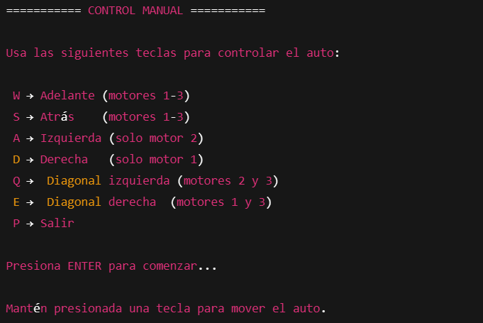

<a name="readme-top"></a>
![Maintained][Maintained-shield]
![Forks][Forks-shield]
![Pull Request][PullRequest-shield]
![Pull Request Closed][PullRequestclosed-shield]

<!-- PROJECT LOGO -->
<br />
<div align="center">
  <a href="https://github.com/NicoZela23/CV-Robotic-Claw">
    
  </a>

<h3 align="center">Omni Robot</h3>

  <p align="center">
    Motoron powered Robotic Car
    <br />
    <a href="https://github.com/NicoZela23/Omni-Motoron-Robot/blob/main/README.md"><strong>Explora la documentacion »</strong></a>
    <br />
    <br />
    ·
    <a href="https://github.com/NicoZela23/Omni-Motoron-Robot/issues">Reportar Bug</a>
    ·
    <a href="https://github.com/NicoZela23/Omni-Motoron-Robot/issues">Solicitar Feature</a>
  </p>
</div>

<!-- TABLE OF CONTENTS -->
<details>
  <summary>Tabla de contenido</summary>
  <ol>
    <li>
      <a href="#acerca-del-proyeto">Acerca Del Proyeto</a>
    </li>
    <li><a href="#hardware-necesario">Hardware Necesario</a></li>
    <li><a href="#configuracion-de-entorno">Configuracion de entorno</a></li>
    <li>
      <a href="#descarga">Descarga</a>
    </li>
    <li><a href="#instalacion">Instalacion</a></li>
    <li><a href="#configuracion-del-robot">Configuracion del robot</li>
    <li><a href="#tech-stack">Tech Stack</a></li>
    <li><a href="#descripcion-tecnica">Descripcion tecnica</a></li>
    <li><a href="#video-funcionamiento">Video funcionamiento</a></li>
  </ol>
</details>

## Acerca Del Proyeto

`OmniRobot` es un proyecto de robótica de código abierto diseñado para construir y programar un robot móvil omnidireccional desde cero. Este repositorio no solo contiene el código de control, sino que también se basa en una guía de hardware detallada , pensada para guiar a usuarios sin experiencia previa en robótica o electrónica.

El robot utiliza un chasis triangular con tres ruedas omnidireccionales dispuestas a 120° , lo que le permite una movilidad completa en cualquier dirección: adelante, atrás, desplazamientos laterales, diagonales y rotación sobre su propio eje.

El cerebro de la operación es una **_Raspberry Pi_** 4, que ejecuta un script en Python para orquestar todos los movimientos. El control preciso de los motores y la lectura de su velocidad se logran mediante componentes especializados, lo que convierte a este proyecto en una excelente plataforma de aprendizaje.

---

### Características Principales

- **Control Centralizado**: Una **_Raspberry Pi 4 Model B_** (4GB RAM) se encarga de toda la lógica de alto nivel.

- **Movimiento Omnidireccional**: Impulsado por tres motores DC JGB37-520 con encoders de efecto Hall integrados.

- **Control de Potencia Avanzado**: Utiliza un driver Pololu M3H550 Triple Motor Driver, que se comunica con la **_Raspberry Pi_** a través del protocolo I2C para gestionar la velocidad y dirección de cada motor de forma independiente.

- **Alimentación Autónoma**: El sistema es totalmente portátil, alimentado por dos baterías LiPo de 11.1V y reguladores de voltaje DC-DC para suministrar la energía necesaria tanto a la **_Raspberry Pi_** (5V) como a los motores (10.5V).

- **Control Remoto**: El robot se opera de forma inalámbrica a través de una conexión SSH, permitiendo el control manual mediante el teclado de una laptop o PC.

- **Software**: El control se implementa en un único script de Python, utilizando las librerías motoron para la comunicación con el driver y RPi.GPIO para la lectura de los encoders.

---

### ¿Qué aprenderás con este proyecto?

- Ensamblar una estructura robótica mecánica a partir de perfiles de aluminio.

- Conectar y controlar motores de corriente continua (DC) y leer su velocidad en tiempo real utilizando encoders.

- Implementar un sistema de alimentación autónomo y seguro utilizando baterías LiPo y reguladores de voltaje.

- Controlar hardware externo (un driver de motores) desde la Raspberry Pi utilizando el bus de comunicación I2C.

- Desarrollar un script de control en Python que gestione entradas de usuario (teclado), procese datos de sensores (encoders) y actúe sobre los motores de forma concurrente.

## Hardware Necesario

> [!IMPORTANT]
> Este proyecto requiere de Hardware específico tanto para su construcción como para su operación.  
> La estructura principal se ensambla con perfiles de aluminio y soportes metálicos que sostienen los componentes.

A continuación se detalla la lista completa de componentes electrónicos y estructurales utilizados:

| **Componente**         | **Cantidad** | **Modelo / Especificaciones**                                       |
| ---------------------- | ------------ | ------------------------------------------------------------------- |
| Microcontrolador       | 1            | Raspberry Pi 4 Model B (4GB RAM)                                    |
| Controlador de Motor   | 1            | Pololu M3H550 Triple Motor Driver                                   |
| Motores DC             | 3            | JGB37-520 con encoder de efecto Hall integrado (12V, 330 RPM)       |
| Ruedas                 | 3            | Ruedas omnidireccionales de 60 mm con rodillos laterales            |
| Baterías               | 2            | LiPo 3S (3 celdas) de 11.1V, 2200mAh (Marca Turnigy)                |
| Reguladores de Voltaje | 2            | Regulador descendente (step-down) LM2596 DC-DC                      |
| Chasis                 | 1            | Perfil de aluminio tipo ranurado (modelo 2020)                      |
| Soportes de Motor      | 3            | Soporte metálico personalizado para fijación al chasis              |
| Prototipado y Conexión | Varios       | Protoboard, cables jumper (macho-macho, hembra-hembra) y terminales |
| Elementos de Fijación  | Varios       | Tornillos tipo Allen, tuercas en T, escuadras y arandelas           |

---

> [!NOTE]
> Para obtener los detalles completos sobre el ensamblaje, las conexiones eléctricas y los diagramas,  
> es fundamental consultar la guía de construcción y el manual de hardware en [Omni Robot Docs](https://drive.google.com/file/d/1BgFtPWnTz3hPScd1Ap16ELC2zDu8Rw9G/view?usp=sharing).

---

### Resultado final de la construcción:


## Configuracion de entorno

Considerando que el proyecto hace uso de la libreria `motoron` es importante instalar la misma, considerando que no esta disponible directamente desde `pip` esta debe ser integrada de la siguiente manera desde el raspberry pi

```
$ mkdir project_library
$ cd project_library
$ git pull https://github.com/pololu/motoron-python.git
```

Con esto tendremos disponible toda la libreria junto con ejemplos de uso para los casos de us `motoron`

## Descarga

> [!IMPORTANT]
> Ya que esta libreria es especifica del fabricante `Pololu` para poder hacer uso de la libreria `motoron` debemos clonar este proyecto y extraer el script `robot.py` dentro de los archivos de la carpeta `motoron-python` donde se encuentran disponibles los archivos core

```
$ cd project_library
$ cd motoron-python
$ git clone https://github.com/NicoZela23/Omni-Motoron-Robot.git
$ mv Omni-Motoron-Robot/* .
```

## Instalacion

El proyecto no requiere de una instalacion mas alla de la ejecucion del script de Python `robot.py`

```
$ sudo python robot.py
```

## Configuracion del robot

La configuracion mas crucial del proyecto recaera en el uso del mismo siendo las opciones base del menu, todo ejecutado desde la shell con comandos simples ingresados por consola



## Tech Stack

[]()
[]()
[](https://www.python.org/)
[]()

## Descripcion tecnica

El script `robot.py` permite:

- Inicializar y configurar la placa Motoron vía I2C.
- Leer los encoders conectados a los motores para obtener posición y velocidad.
- Controlar el movimiento del robot mediante comandos de teclado.
- Mostrar información en tiempo real sobre el estado de los motores.

### Estructura del Script `robot.py`

El script está organizado en las siguientes secciones:

- **Importación de librerías**
- **Configuración de Motoron**
- **Configuración de encoders y GPIO**
- **Funciones auxiliares** (cálculo de velocidades, impresión de estado, lectura de teclado, etc.)
- **Lógica principal de control**

### Configuración de Hardware

#### Motoron

- **Placa utilizada:** Motoron (controlador de motores DC vía I2C)
- **Dirección I2C:** 17 (puede variar según configuración física)
- **Motores soportados:** 3

#### Encoders

- **Cantidad:** 3 (uno por motor)
- **CPR (Counts Per Revolution):** 1000
- **Pines asignados:**

| Motor | pin_a | pin_b |
| ----- | ----- | ----- |
| 1     | 22    | 27    |
| 2     | 18    | 15    |
| 3     | 17    | 14    |

#### GPIO y Pines

- **Modo:** BCM (Broadcom SOC channel)
- **Pull-up:** Activado para evitar estados flotantes

### Lógica de Control de Motores

- **Aceleración máxima:** 80
- **Desaceleración máxima:** 300
- **Velocidad base:** 750 (ajustable)
- **Control individual de cada motor** mediante la función `set_motors(speed1, speed2, speed3)`

### Lectura y Cálculo de Encoders

- **Lectura por interrupciones:** Se utiliza `GPIO.add_event_detect` para detectar cambios en los pines de los encoders.
- **Cálculo de velocidad:**
  - Se calcula la diferencia de cuentas en un intervalo de tiempo (`delta_counts / dt`).
  - Conversión a RPM: `(velocidad_encoder * 60) / CPR`.
- **Almacenamiento de cuentas y velocidades** en diccionarios por motor.

### Control Manual por Teclado

- **Lectura no bloqueante:** Permite detectar teclas sin detener el programa.
- **Teclas asignadas:**

| Tecla | Acción             | Motores afectados |
| ----- | ------------------ | ----------------- |
| W     | Adelante           | 1, 2, 3           |
| S     | Atrás              | 1, 2, 3           |
| A     | Izquierda (giro)   | 2                 |
| D     | Derecha (giro)     | 1                 |
| Q     | Diagonal izquierda | 2, 3              |
| E     | Diagonal derecha   | 1, 3              |
| P     | Salir              | -                 |

- **Detección de pulsación:** Si no se detecta una tecla durante 0.5 segundos, los motores se detienen automáticamente.

### Funciones Clave

- `setup_motoron(mc, address)`: Inicializa y configura la placa Motoron.
- `setup_gpio_encoders()`: Configura los pines GPIO para los encoders y asocia callbacks.
- `encoder_callback(channel)`: Actualiza el conteo de encoders según el cambio detectado.
- `calculate_velocities()`: Calcula la velocidad de cada motor en cuentas por segundo.
- `calculate_rpm(encoder_velocity, counts_per_revolution)`: Convierte la velocidad a RPM.
- `print_status()`: Muestra el estado actual de los motores.
- `get_key_nonblocking(timeout)`: Lee teclas del teclado sin bloquear la ejecución.
- `set_motors(speed1, speed2, speed3)`: Asigna velocidades a los motores.
- `stop_motors()`: Detiene todos los motores.

### Manejo de Errores y Seguridad

- **Inicialización protegida:** Si falla la inicialización de Motoron, el programa muestra un error y termina.
- **Manejo de interrupciones:** Captura `KeyboardInterrupt` para detener los motores y limpiar los GPIO.
- **Limpieza de recursos:** Siempre se ejecuta `GPIO.cleanup()` al finalizar.

### Flujo Principal del Programa

1. Inicializa Motoron y los encoders.
2. Configura aceleración y desaceleración de los motores.
3. Espera a que el usuario presione ENTER para comenzar.
4. Entra en un bucle donde:
   - Lee teclas del usuario.
   - Controla los motores según la tecla presionada.
   - Calcula y muestra el estado de los motores periódicamente.
   - Detiene los motores si no hay pulsación reciente.
5. Al salir, detiene los motores y limpia los GPIO.

### Tablas de Referencia

#### Asignación de Pines de Encoders

| Motor | pin_a | pin_b |
| ----- | ----- | ----- |
| 1     | 22    | 27    |
| 2     | 18    | 15    |
| 3     | 17    | 14    |

#### Comandos de Teclado

| Tecla | Acción             |
| ----- | ------------------ |
| W     | Adelante           |
| S     | Atrás              |
| A     | Izquierda (giro)   |
| D     | Derecha (giro)     |
| Q     | Diagonal izquierda |
| E     | Diagonal derecha   |
| P     | Salir              |

### Recomendaciones y Buenas Prácticas

- **Verificar conexiones físicas** antes de ejecutar el script.
- **No modificar la dirección I2C** sin ajustar el hardware.
- **Ajustar los parámetros de aceleración y velocidad** según el peso y características del robot.
- **Utilizar fuentes de alimentación adecuadas** para evitar caídas de voltaje.
- **Probar individualmente cada motor y encoder** antes de pruebas completas.

## Video funcionamiento


[Maintained-shield]: https://img.shields.io/badge/Maintained%3F-yes-green.svg
[Forks-shield]: https://img.shields.io/github/forks/NicoZela23/Omni-Motoron-Robot.svg
[PullRequest-shield]: https://img.shields.io/github/issues-pr/NicoZela23/Omni-Motoron-Robot.svg
[PullRequestclosed-shield]: https://img.shields.io/github/issues-pr-closed/NicoZela23/Omni-Motoron-Robot.svg
